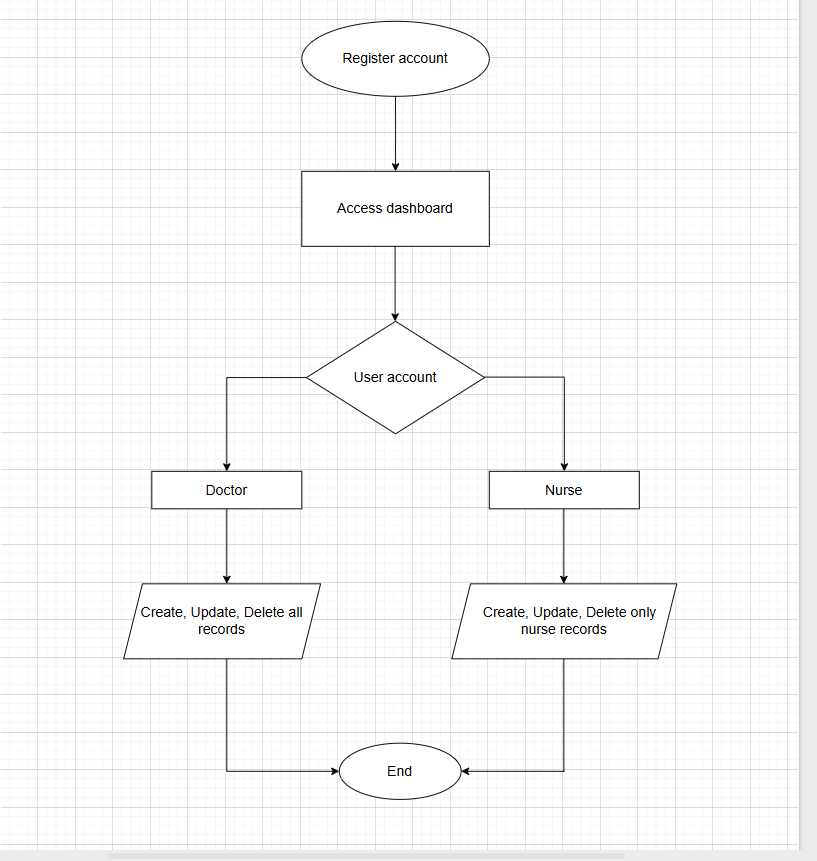
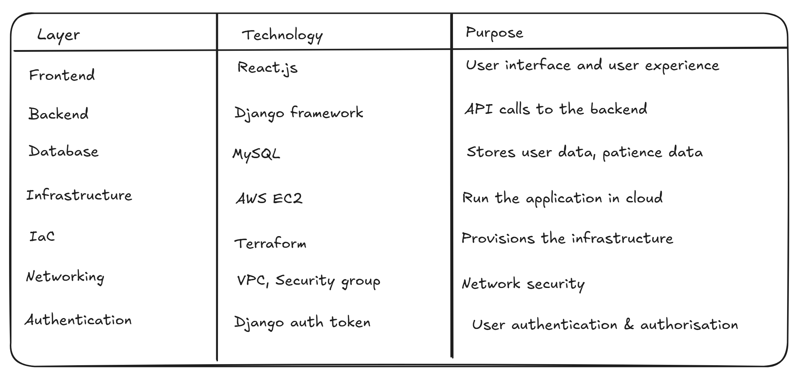
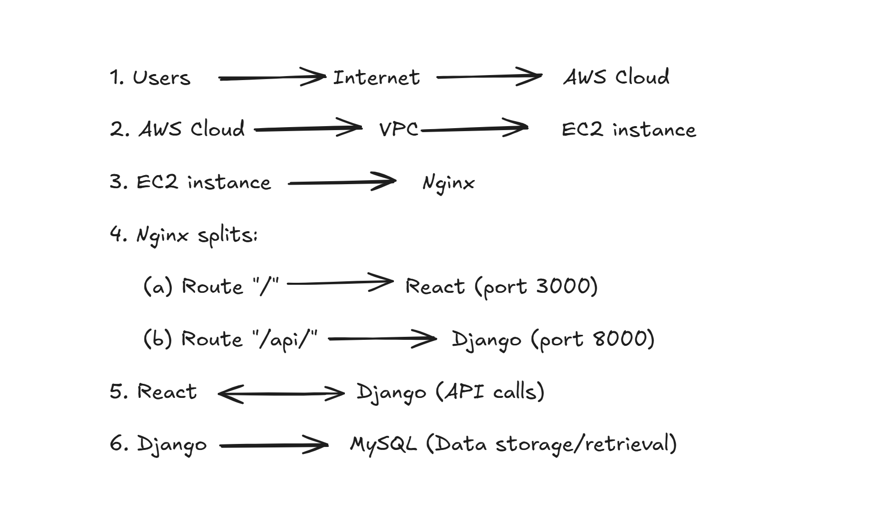
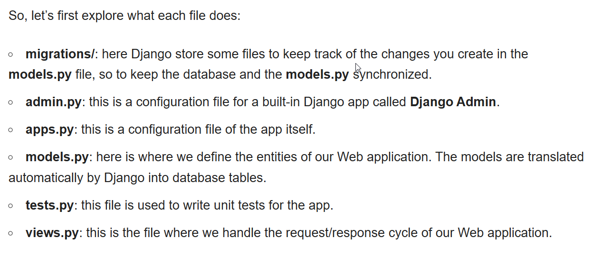

### Overview

This project demonstrates a proof of concept (POC) of a simple web application that performs a simple CRUD (Create, Update, Delete) task

A proof-of-concept health directory registry system which allows healthcare professionals to manage patient records with role-based access control. Built React, Django and MySQL and deployed on AWS EC2 infrastructure provisioned through Terraform.

### End user flow

The diagram below gives a brief overview of how the application basically works and the iterations from accessing the dashboard, registering an account, access management and perform the CRUD operation

### Technology stack

### Application flow (sort of architecture)

